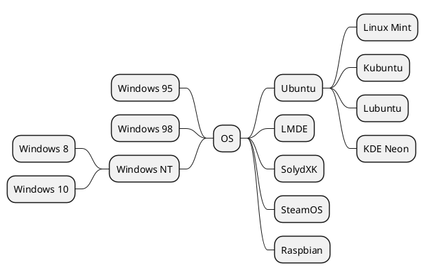
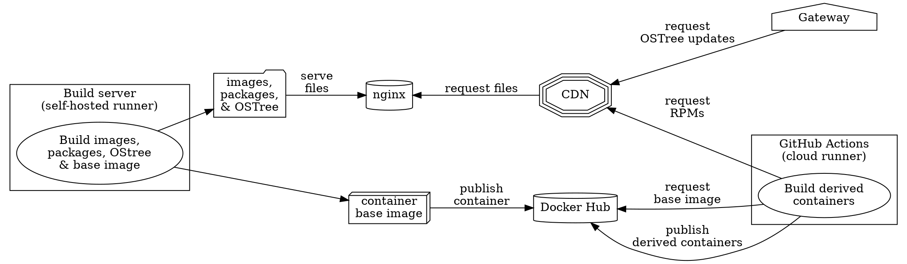

## The problem

I was very proud of the diagrams I added in my [previous post](/blog/remark-all-the-things/), but there was something a bit off about them.
Here's what the PlantUML diagram looked like when I initially made that post.
Note the monospace font:


The Graphviz diagram had even more issues.
Lots of problems with text spacing on this one, and a weird border around the whole thing:


I noticed these issues when I made the post, but I just shrugged, chalked it up to an oddity of Kroki, and decided it was good enough.
I didn't really understand the problem until I was working on adding another feature that used a button with an SVG icon.
The strokes were coming out as `black`, even though my CSS clearly specified that they should be `white`!
When I opened the post up in the inspector, I was surprised to discover an inline stylesheet that I *definitely* didn't write myself, that was changing them to `black`.

At first, I blamed my [oEmbed](/blog/remark-all-the-things/#oembed) integration, because it meant that I could blame Google for the problem, and I like to blame Google for things.
The problem persisted when I created a test post with just the diagrams, though.
What was going on?

It turns out that `<svg>` tags can contain `<style>` tags.
What took me by surprise is that the `<style>` tags in an inline SVG can affect _other_ SVGs in the document.
The Svgbob diagram contained such a stylesheet, resulting in a bunch of styles that were only intended for the Svgbob diagram to leak out and affect other SVGs on the page.

I take back what I said about you being the best, Svgbob.

## Fixing it

As you may recall, I have already [engaged the services](/blog/remark-all-the-things/#diagrams) of [jaywcjlove/rehype-rewrite](https://github.com/jaywcjlove/rehype-rewrite) to strip any hardcoded height or width from the SVG, so that I can make them automatically scale to your browser window.
Since we've already been to the hammer store, let's try treating this problem as a nail.
I've moved the `rewriteKrokiSVG` function that I wrote for that purpose out to its [own file](https://github.com/jordemort/jordemort.github.io/blob/main/src/utils/rewriteKroki.mjs) (and renamed it) and extended it to help me deal with these troublesome inline `<style>` tags:

```javascript
export function rewriteKroki(node) {
  ... // remove fixed height or width; see previous post

  // generate a unique ID for the node based on its position
  let node_id = "svg-" + [
    node.position.start.line,
    node.position.start.column,
    node.position.start.offset
  ].join("-");

  // give the node the ID we generated
  node.properties.id = node_id;

  // rewrite all the styles to include the node ID
  rewriteStyles(node, node_id);
}
```

The new stuff starts with generating a unique ID for the SVG.
My original implementation used a random UUID, but I wanted something shorter.
I also wanted something that wasn't going to change every singe time the page was regenerated.
I tried using a sha256 of the node's contents, but the result was too long for my taste, and if I used a weaker hash function then I couldn't get FIPS certification for this blog.
I tried encoding the hashes with [Base85](https://en.wikipedia.org/wiki/Ascii85), and that shortened them up a bit, but not by much, and also required an additional dependency.
Eventually, I noticed that Rehype gives me the position that the `<svg>` tag originally appeared in the document; this seems pretty unique and won't change over multiple runs, as long as the rest of the document doesn't.
It also ends up being satisfyingly short.

My initial implementation of this (with UUIDs) didn't work consistently.
Eventually I figured out that it is forbidden to start either a [CSS class names](https://stackoverflow.com/questions/448981/which-characters-are-valid-in-css-class-names-selectors) or an [HTML ID attribute](https://stackoverflow.com/questions/70579/what-are-valid-values-for-the-id-attribute-in-html) with a number.
When I was lucky enough to generate a UUID that started with a letter, it worked.
If the UUID I generated started with a number, none of the styles would apply.
To fix this, I prepend `"svg-"` to the generated ID.

After giving the SVG a unique ID, the next step is to re-write any `<style>` tags inside of it:

```javascript
function rewriteStyles(node, node_id)
{
  if (node.type != "element") {
    return;
  }

  if (node.tagName != "style") {
    // rewrite any child <style> tags
    node.children.forEach((child) => { rewriteStyles(child, node_id); });
    return;
  }

  // rewrite CSS in text nodes
  node.children.forEach((child) => {
    if (child.type === "text") {
      child.value = rewriteCSS(child.value, node_id);
    }
  });
}
```

This function recurses down the DOM looking for inline `<style>` tags; when it finds one, it sends it off to `rewriteCSS`:

```javascript
import css from "css";

function rewriteCSS(styles, node_id) {
  let parsed = css.parse(styles);

  // add node_id to all selectors
  parsed.stylesheet.rules.forEach((rule) => {
    rule.selectors = rule.selectors.map((selector) => `#${node_id} ${selector}`);
  });

  return css.stringify(parsed);
}
```

This uses [reworkcss/css](https://github.com/reworkcss/css) to parse the styles, and prefixes each selector with the unique ID we generated, so that it will only apply inside of the `<svg>` tag with that ID.

### What about Mermaid?

You may have noticed that I've left [Mermaid](https://mermaid-js.github.io/mermaid/) out of the discussion so far.
That's because Mermaid is a good DOM citizen, and already does this; each diagram has a unique ID, and every rule in a Mermaid diagram's `<style>` tag is prefixed with that ID.
I stole the idea from them.

Initially, I tried to scope the rules like [Astro](https://docs.astro.build/en/guides/styling/#scoped-styles) does, but Mermaid's technique was simpler; copying Astro's approach would involve adding an additional class to every single element in the SVG.
Astro probably needs to do this because an Astro component isn't necessarily entirely encapsulated within a single tag.
Since I can count on everything I want to style here being a child of a single `<svg>` element, I don't need to do as much work as Astro does.

## The result

First, here's that mean old Svgbob diagram again, to prove the problem is fixed:

```svgbob
        .---.                      _
       /-o-/--       .--.         |-|               .--.
    .-/ / /->       /--. \     .--)-|    .--.-.    //.-.\
   ( *  \/         / O  )|     |  |-|    |->| |   (+(-*-))
    '-.  \        /\ |-//      .  * |    '--'-'    \\'-'/
       \ /        \ '+'/        \__/                '--'
        '          '--'
                                           _____
       .----.               _             /   __)\
       |    |           ,--(_)            |  /  \ \
     __|____|__       _/ .-. \         ___|  |__/ /
    |  ______--|     (_)(   ) )       / (_    _)_/
    `-/.::::.\-'       \ `-'_/       / /  |  |
     '--------'         `--(_)       \ \__/  |
                                      \(_____/

```

Next, the PlantUML diagram, as it was intended to appear:



And finally, the Graphviz diagram in all its correctly-rendered glory:



## What's next?

Right now I'm working on adding buttons to my code blocks to copy their contents to the clipboard, and buttons to my diagrams to expand them to the full size of the window.
I'm using SVG icons on the buttons, which is how I discovered this problem.

After that, I think I'll finally tackle tags and search!

<style>#mangled-plantuml { content:url("/images/mangled-plantuml.light.png") } #mangled-graphviz { content:url("/images/mangled-graphviz.light.png") } @media (prefers-color-scheme: dark) { #mangled-plantuml { content:url("/images/mangled-plantuml.dark.png") } #mangled-graphviz { content:url("/images/mangled-graphviz.dark.png") }}</style>
