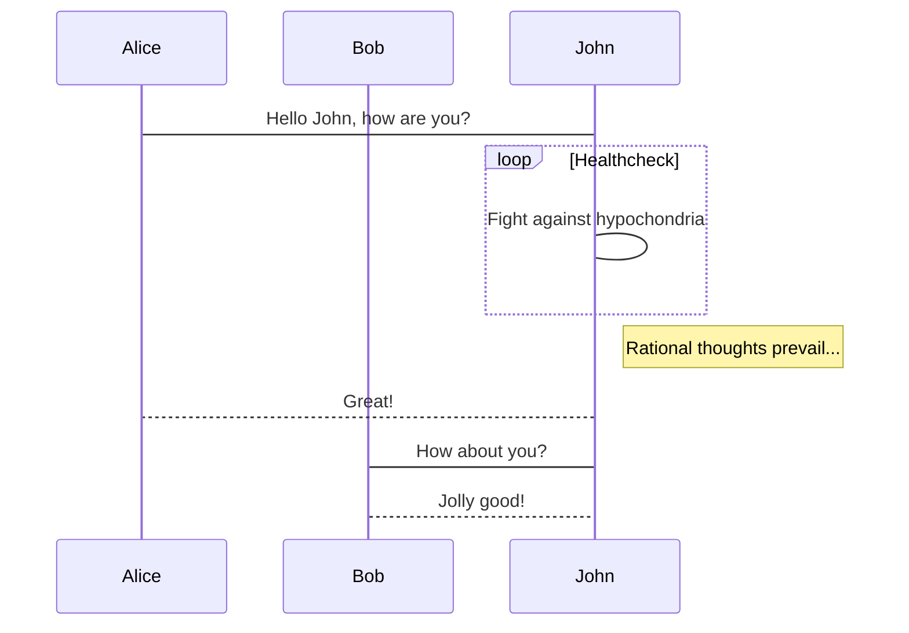
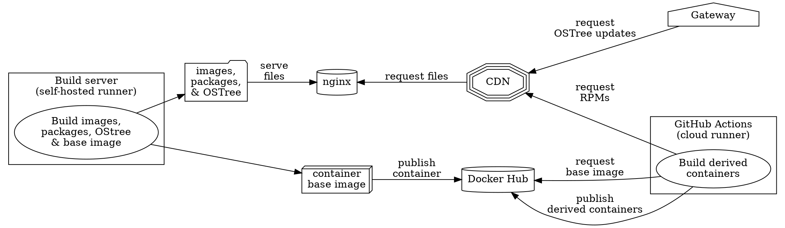
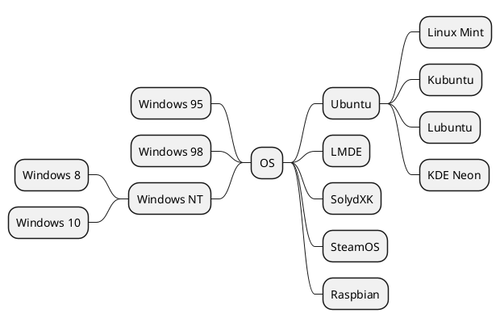

As touched upon in a [previous post](/blog/kill-all-the-boilerplate/), [Astro](https://astro.build/) supports using [Remark](https://github.com/remarkjs/remark) plugins, which can be used to customize how Markdown is transformed into HTML.
It also supports [Rehype](https://unifiedjs.com/explore/package/rehype/) plugins, which can be used to modify the resulting HTML after it has been transformed.
In order to support rendering the kinds of posts I want to write, I've added a bunch of these plugins to this blog.
Have a look at my [`astro.config.mjs`](https://github.com/jordemort/jordemort.github.io/blob/main/astro.config.mjs) and view the [source of this post](https://github.com/jordemort/jordemort.github.io/blob/main/src/pages/blog/remark-all-the-things.md?plain=1), then come back here for an explanation of what I've done.

## Don't forget `extendDefaultPlugins`!

Astro uses some Remark plugins by default, including [remarkjs/remark-gfm](https://github.com/remarkjs/remark-gfm) for some GitHub-like extensions, but only if you don't specify your own `remarkPlugins`.
I had inadvertently disabled this when I added my custom plugins. I had to set [`extendDefaultPlugins`](https://docs.astro.build/en/reference/configuration-reference/#markdownextenddefaultplugins) to `true` to tell Astro that I wanted default plugins in addition to my custom ones.
Now I can make tables again, like this:

| Turtle | Assessment |
|-|-|
| Leonardo | Overrated |
| Raphael | Anger issues &mdash; needs therapy |
| Michelangelo | Seems fun, probably also needs therapy |
| Donatello | Relatable; definitely needs therapy |

## Math

For a computer scientist, I'm a pretty mediocre mathematician.
Nevertheless, I might one day want to write an equation or two on this blog.

For this, I'm using the plugins from [remarkjs/remark-math](https://github.com/remarkjs/remark-math).
They offer a choice between using [KaTeX](https://katex.org/) or [MathJax](https://www.mathjax.org/) to render your math.
I admit to not knowing much about the relative merits of either.
MathJax sounded like the technically superior solution, so I tried that first, but the equations it rendered were not selectable with the text selection tool, even when I tried to use [HTML output](http://docs.mathjax.org/en/latest/output/html.html).
Maybe I was doing something wrong?
Anyway, I switched to KaTeX, which I've used before, and now I can write things like  $\omega = d\phi / dt$ and $I = \int \rho R^{2} dV$.
Maybe one day I'll even understand what they mean.

## Emoji

I'm very used to doing Markdown the "GitHub way" and I'm too lazy to figure out how to type emoji, so I wanted to be able to use shortcodes like `:smile:` in my Markdown.
[remarkjs/remark-gemoji](https://github.com/remarkjs/remark-gemoji) allows me to do exactly that! :smile:

I also added [rehype-accessible-emojis](https://www.npmjs.com/package/rehype-accessible-emojis) - this marks up any emoji with descriptive tags so it won't be incomprehensible to people using screen readers. :tada:

## oEmbed

[oEmbed](https://oembed.com/) is a standard that allows web sites to make parts of their content embeddable on other websites.
This is handy for things like tweets and YouTube videos.
I tried a few different implementations of this, and eventually settled on [jodyheavener/remark-plugin-oembed](https://github.com/jodyheavener/remark-plugin-oembed), mainly on the strengths of not making NPM scream at me about vulnerabilities and putting a `oembed-container` class on the `<div>` it generates so I can easily style it.
Now I can toss videos into my posts like this:

https://www.youtube.com/watch?v=50wElcsgCxQ

...or tweets, like this:

https://twitter.com/dasharez0ne/status/1562245779644747776

This one gave me a bit of a scare.
While debugging other things on this page, I saw requests going out to Google servers.
How did external content snuck on to my dev server, I wondered?
The answer is simple: I embedded it.

## Diagrams

GitHub recently announced [support](https://docs.github.com/en/get-started/writing-on-github/working-with-advanced-formatting/creating-diagrams) for [Mermaid](https://mermaid-js.github.io/mermaid/) diagrams in Markdown.
Of course, I deserve to have everything that GitHub does:



Again, I tried a few different solutions here; the one I settled on was [nice-move/remark-kroki](https://github.com/nice-move/remark-kroki).
This is built on top of [Kroki](https://kroki.io/), which is an extremely cool service that provides a single API to a huge assortment of diagram languages.
It's easy to [self-host Kroki](https://docs.kroki.io/kroki/setup/install/); eventually I'll get around to spinning a copy of it up during my build process, but for now I'm using their [free service](https://kroki.io/#try); this doesn't seem to come with any drawbacks, aside from not being personally in control of its uptime.

I wasn't 100% happy with how the plugin rendered diagrams; instead of creating an inline `<svg>` element, it created an `` tag with the `src` set to a base64-encoded data URL containing the SVG.
Aside from being inefficient, this prevented text selection from working inside of diagrams.
I [modified the plugin](https://github.com/nice-move/remark-kroki/pull/1) to return an inline `<svg>` tag instead (and wrapped it in a `<div class='kroki'>` for ease of styling.)
Hopefully the maintainer is interested in my changes; if not, I might finally publish my first thing on NPM.

As I mentioned, Kroki supports a lot more than Mermaid.
As a huge nerd, I especially appreciate that it supports [Graphviz](https://graphviz.org/):



It also supports [PlantUML](https://plantuml.com/):



The best format that Kroki supports is definitely [Svgbob](https://ivanceras.github.io/svgbob-editor/), though:

```svgbob
        .---.                      _
       /-o-/--       .--.         |-|               .--.
    .-/ / /->       /--. \     .--)-|    .--.-.    //.-.\
   ( *  \/         / O  )|     |  |-|    |->| |   (+(-*-))
    '-.  \        /\ |-//      .  * |    '--'-'    \\'-'/
       \ /        \ '+'/        \__/                '--'
        '          '--'
                                           _____
       .----.               _             /   __)\
       |    |           ,--(_)            |  /  \ \
     __|____|__       _/ .-. \         ___|  |__/ /
    |  ______--|     (_)(   ) )       / (_    _)_/
    `-/.::::.\-'       \ `-'_/       / /  |  |
     '--------'         `--(_)       \ \__/  |
                                      \(_____/

```

One mild inconvenience: the graphs are always rendered for display on light backgrounds, which isn't great if the background of the page is dark, as it is on this site for folks whose browsers have been told to prefer dark themes.
To deal with this, I've added a bit of CSS to invert the colors if the site is in dark mode:

```css
@media (prefers-color-scheme: dark) {
  .kroki svg {
    filter: invert(100%);
  }
}
```

The `<svg>` tags that Kroki returns often often come with `height` and `width` and/or `style` attributes that I wish weren't there.
I'd prefer to do all the styling myself, so that the diagrams scale to the browser window.
To strip out the unwanted styling, I'm using [jaywcjlove/rehype-rewrite](https://github.com/jaywcjlove/rehype-rewrite).
Because the diagrams get inserted as `raw` nodes, the HTML isn't usually parsed, so I also had to add in [rehype-raw](https://github.com/rehypejs/rehype-raw):

```javascript
function rewriteKrokiSVG(node) {
  let height = node.properties.height;
  let width = node.properties.width;

  delete node.properties.style;
  delete node.properties.height;
  delete node.properties.width;

  node.properties.preserveAspectRatio = "xMidYMid";

  /* if there is no viewBox, synthesize one */
  if (height && width && !node.properties.viewBox) {
    node.properties.viewBox = `0 0 ${width} ${height}`;
  }
}

export default defineConfig({
  ...
  markdown: {
    ...
    rehypePlugins: [
      ...
      rehypeRaw,
      [rehypeRewrite, {
        selector: ".kroki svg",
        rewrite: rewriteKrokiSVG
      }]
    ],
    ...
  }
});
```

## Syntax highlighting

As seen above.
I didn't really have to do anything special for this, as Astro already comes with the [Shiki](https://shiki.matsu.io/) syntax highlighter.
All I did here was switch the theme to Dark Plus.

## What's left?

There's only a couple things left that I want to add to this site:

- Tags for posts &mdash; the posts actually already have tags defined in their frontmatter, I just need to start doing something with them.
- Client-side search &mdash; my current plan is to use [sql.js-httpvfs](https://github.com/phiresky/sql.js-httpvfs) for this, as it's the only solution I've seen that won't require clients to download the entire index up-front.

Stay tuned!
